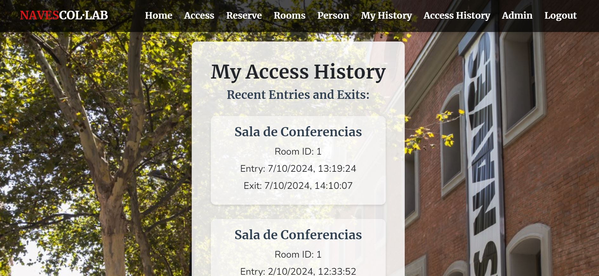

# Naves Coworking Frontend🪐

Welcome to my Naves Coworking Frontend project, I hope you like it!🏵️
<br><br>

</a>

<details>
  <summary>Table of Contents📝</summary>
  <ol>
 <li><a href="#description">Description</a></li>
    <li><a href="#objetive">Objetive</a></li>
    <li><a href="#stack">Stack</a></li>
    <li><a href="#local-installation">Local installation</a></li>
    <li><a href="#views">Views</a></li>
    <li><a href="#future-functionalities️">Future functionalities</a></li>
    <li><a href="#development">Development</a></li>
    <li><a href="#appreciations">Appreciations</a></li>
    <li><a href="#contact">Contact</a></li>
  </ol>
</details>
<br>

## Description📚

This frontend project focuses on offering an intuitive and friendly interface that allows users to interact fluidly with the key functionalities of coworking. Through a modern and adaptable application, users will be able to easily manage their room reservations, monitor their arrivals and departures in real time, and access personalized reports that facilitate administrative decision making.

The frontend focus is on ensuring that every user, from administrators to workers, has a fast, efficient and visually appealing experience, achieving seamless integration with backend services. The design has been designed to simplify navigation, offering a platform that adjusts to the needs of day to day life in a collaborative space, optimizing both the management of operations and interaction with users.

<p align="center">

</p>

## Objetive🎯

This frontend system will allow users to easily interact with the platform to register their accesses, make room reservations, and review their activity history. For administrators, the interface will provide accessible tools to generate detailed reports and monitor room usage statistics. By offering a user-friendly design and seamless integration with the backend services, the goal is to enhance resource management, improve organization, and provide a secure and transparent environment for all users.

- **User Experience:** Create a smooth and intuitive platform that minimizes the effort required to manage access and reservations.

- **Transparency: Offer** users and administrators a clear view of their access history and room reservations through easy-to-navigate components.

- **Data Visualization:** Enable administrators to make informed decisions through visualized statistics and reports on room usage.

- **Security:** Implement user-friendly security measures to ensure only authorized users have access to the rooms.


## Stack📒
Used technology:
<div align="center">
<a>
    
</a>
<a>
    
</a>
<a>
    
</a>
<a>
    
</a>
<a>

</a>
<a>
    
</a>
<a>
    
</a>
<a>
    
</a>
<a>
    
</a>
<a>
    
</a>
</div>


## Local installation Frontend📊

1. Clone the repository
2. ``` $ npm install  ```
3. ``` $ npm run dev ```

### Local installation Backend⚙️

1. Install docker and create a mysql container
1. Clone the repository
2.  ``` $ npm install  ```
3. We connect our repository with the database
4. ``` $ npm run dev ``` 
5. ``` $ We execute the migrations $ npm run migrate ``` 
6. ``` $ We run the seeders $ npm run db:seed ``` 
7. ...


## Views🧩
 Admin user: david@david.com password:123456789

### Home🏠


### Login and Register🔑


### Person👥


### Access💯


### Reserve✏️


### Room📓


### My history🔍



### Access history👀 (Admin)


### Administration💯 (Admin)


## Future functionalities⏭️
- Custom filters.
- Notifications.
- User Management.
- ...


## Development👨🏻‍💻

```js
const developer = "DavidFernandez";

console.log("Developed by: " DavidFernandez);
```

## Appreciations💯

I would like to dedicate my thanks to the teachers at Geeks Hubs as well as my day to day peers with whom we can help each other with our problems.


## Contact📲
- **David Fernandez Valle**
  - [GitHub](https://github.com/Davfernandezz)
  - [Linkedin](https://www.linkedin.com/in/david-fern%C3%A1ndez-valle-1b4461300/?originalSubdomain=es)
